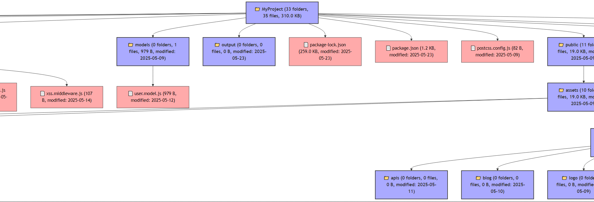

# Flow-Codemind - Auto Flowchart Generator Project Structure (🇮🇩)

**Flow-Codemind** adalah alat untuk memindai struktur folder dan file di dalam direktori proyek secara otomatis, lalu menghasilkan flowchart berformat Mermaid (.mmd) yang menggambarkan hierarki folder dan file tersebut. Flowchart juga dapat diekspor ke gambar PNG, JPG, atau SVG menggunakan `mmdc`.

### Fitur Utama

- Memindai folder secara rekursif hingga kedalaman tertentu.
- Filter file berdasarkan ekstensi, ukuran minimum, dan nama folder/file yang dikecualikan.
- Menyorot file atau folder yang mengandung kata kunci tertentu.
- Menyortir berdasarkan nama, ukuran file, atau tanggal modifikasi.
- Menampilkan file, folder, atau keduanya sesuai pilihan.
- Menampilkan ukuran file dalam format yang mudah dibaca (KB, MB).
- Menyimpan hasil flowchart dalam file `.mmd`.
- Ekspor otomatis ke format gambar (PNG, JPG, SVG) dengan `mermaid-cli` (`mmdc`).
- Warna kustom untuk folder, file biasa, dan file besar.
- Opsi collapse otomatis untuk folder pada visualisasi.

### Cara Penggunaan

```js
const flowchartGen = require('flow-codemind');

(async () => {
  const result = await flowchartGen.init('./', {
    baseName: 'MyProject',
    outputDir: './output',
    outputFile: 'project-structure.mmd',
  });

  console.log('Stats:', result.stats);
})();
````

Konfigurasi Lanjutan:

```js
const flowchartGen = require('./flow-codemind');
(async () => {
  const result = await flowchartGen.init('./', {
    baseName: 'MyProject',
    outputDir: './output',
    outputFile: 'project-structure.mmd',
    fileExtFilter: ['.js', '.json'],
    excludeNames: ['node_modules', '.git'],
    highlightKeywords: ['views'],
    exportImageFormat: 'png',
    sortBy: 'name',
    nodeType: 'both',
    minFileSize: 0,
    maxDepth: 5,
    showHidden: false,
    humanReadableSize: true,
    collapseFolders: false,
    folderColor: '#aaf',
    fileColor: '#faa',
    largeFileColor: '#f55',
  });
  console.log('Stats:', result.stats);
})();
```

### Opsi Konfigurasi (Config Options)

| Opsi                | Tipe       | Default                    | Deskripsi                                                                              |
| ------------------- | ---------- | -------------------------- | -------------------------------------------------------------------------------------- |
| `baseName`          | `string`   | Nama folder root           | Nama node root pada flowchart.                                                         |
| `outputDir`         | `string`   | `.`                        | Folder tempat menyimpan file hasil flowchart.                                          |
| `outputFile`        | `string`   | `MyProject.mmd`            | Nama file flowchart Mermaid.                                                           |
| `fileExtFilter`     | `string[]` | `[]`                       | Filter ekstensi file (misal: \['.js', '.json']), kosong berarti semua file disertakan. |
| `excludeNames`      | `string[]` | \['node\_modules', '.git'] | Folder/file yang diabaikan saat scan.                                                  |
| `highlightKeywords` | `string[]` | `[]`                       | Keyword untuk menyorot nama file/folder yang mengandung kata ini.                      |
| `exportImageFormat` | `string`   | `undefined`                | Format gambar hasil ekspor: `png`, `jpg`, atau `svg`. Jika tidak diset, tidak ekspor.  |
| `sortBy`            | `string`   | `'name'`                   | Sortir item berdasarkan: `'name'`, `'size'`, atau `'date'`.                            |
| `nodeType`          | `string`   | `'both'`                   | Tampilkan `'file'`, `'folder'`, atau `'both'`.                                         |
| `minFileSize`       | `number`   | `0`                        | Minimal ukuran file dalam byte untuk disertakan.                                       |
| `maxDepth`          | `number`   | `Infinity`                 | Maksimal kedalaman scan folder.                                                        |
| `showHidden`        | `boolean`  | `false`                    | Tampilkan file/folder hidden (dimulai dengan `.`) atau tidak.                          |
| `humanReadableSize` | `boolean`  | `true`                     | Format ukuran file agar mudah dibaca (KB, MB) atau dalam byte saja.                    |
| `collapseFolders`   | `boolean`  | `false`                    | Collapse otomatis folder dalam flowchart.                                              |
| `folderColor`       | `string`   | `#f9f`                     | Warna untuk node folder.                                                               |
| `fileColor`         | `string`   | `#bbf`                     | Warna untuk node file biasa.                                                           |
| `largeFileColor`    | `string`   | `#f99`                     | Warna untuk node file besar (>1MB).                                                    |

---

## Output

* File Mermaid `.mmd` yang dapat dibuka di editor Mermaid atau tools seperti [Mermaid Live Editor](https://mermaid.live/).
* Gambar `.png`, `.jpg`, atau `.svg` hasil ekspor yang menampilkan diagram folder dan file secara visual.

