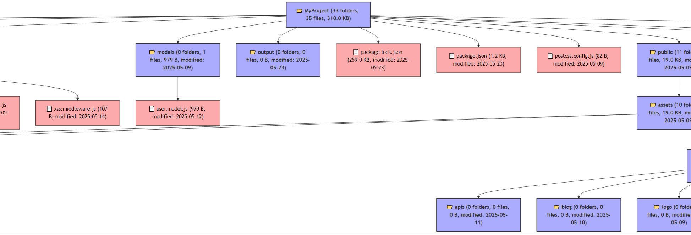

# Flow-Codemind - Auto Flowchart Generator Project Structure (🇺🇸)

**Flow-Codemind** is a tool to automatically scan the folder and file structure inside your project directory and generate a Mermaid (.mmd) flowchart depicting the folder and file hierarchy. The flowchart can also be exported to PNG, JPG, or SVG images using `mmdc`.

### Main Features

* Recursively scan folders up to a certain depth.
* Filter files based on extension, minimum size, and excluded folder/file names.
* Highlight files or folders containing specific keywords.
* Sort by name, file size, or modification date.
* Option to show files, folders, or both.
* Display file sizes in human-readable formats (KB, MB).
* Save the flowchart to a `.mmd` file.
* Automatically export to image formats (PNG, JPG, SVG) using `mermaid-cli` (`mmdc`).
* Custom colors for folders, regular files, and large files.
* Option to automatically collapse folders in the visualization.

### Usage Example

```js
const flowchartGen = require('flow-codemind');

(async () => {
  const result = await flowchartGen.init('./', {
    baseName: 'MyProject',
    outputDir: './output',
    outputFile: 'project-structure.mmd',
  });

  console.log('Stats:', result.stats);
})();
```

Advanced Configuration:

```js
const flowchartGen = require('./flow-codemind');
(async () => {
  const result = await flowchartGen.init('./', {
    baseName: 'MyProject',
    outputDir: './output',
    outputFile: 'project-structure.mmd',
    fileExtFilter: ['.js', '.json'],
    excludeNames: ['node_modules', '.git'],
    highlightKeywords: ['views'],
    exportImageFormat: 'png',
    sortBy: 'name',
    nodeType: 'both',
    minFileSize: 0,
    maxDepth: 5,
    showHidden: false,
    humanReadableSize: true,
    collapseFolders: false,
    folderColor: '#aaf',
    fileColor: '#faa',
    largeFileColor: '#f55',
  });
  console.log('Stats:', result.stats);
})();
```

### Configuration Options

| Option              | Type       | Default                    | Description                                                                      |
| ------------------- | ---------- | -------------------------- | -------------------------------------------------------------------------------- |
| `baseName`          | `string`   | Root folder name           | The root node name in the flowchart.                                             |
| `outputDir`         | `string`   | `.`                        | Folder to save the generated flowchart file.                                     |
| `outputFile`        | `string`   | `MyProject.mmd`            | Name of the Mermaid flowchart file.                                              |
| `fileExtFilter`     | `string[]` | `[]`                       | Filter file extensions (e.g., \['.js', '.json']), empty means include all files. |
| `excludeNames`      | `string[]` | \['node\_modules', '.git'] | Folders/files to exclude during scanning.                                        |
| `highlightKeywords` | `string[]` | `[]`                       | Keywords to highlight in file/folder names.                                      |
| `exportImageFormat` | `string`   | `undefined`                | Image export format: `png`, `jpg`, or `svg`. If unset, no export.                |
| `sortBy`            | `string`   | `'name'`                   | Sort items by `'name'`, `'size'`, or `'date'`.                                   |
| `nodeType`          | `string`   | `'both'`                   | Show `'file'`, `'folder'`, or `'both'`.                                          |
| `minFileSize`       | `number`   | `0`                        | Minimum file size in bytes to include.                                           |
| `maxDepth`          | `number`   | `Infinity`                 | Maximum folder scan depth.                                                       |
| `showHidden`        | `boolean`  | `false`                    | Show hidden files/folders (starting with `.`) or not.                            |
| `humanReadableSize` | `boolean`  | `true`                     | Display file sizes in human-readable format (KB, MB) or bytes only.              |
| `collapseFolders`   | `boolean`  | `false`                    | Automatically collapse folders in the flowchart.                                 |
| `folderColor`       | `string`   | `#f9f`                     | Color for folder nodes.                                                          |
| `fileColor`         | `string`   | `#bbf`                     | Color for regular file nodes.                                                    |
| `largeFileColor`    | `string`   | `#f99`                     | Color for large file nodes (>1MB).                                               |

---

## Output

* Mermaid `.mmd` file viewable in Mermaid editors or tools like [Mermaid Live Editor](https://mermaid.live/).
* Exported `.png`, `.jpg`, or `.svg` images visually displaying folder and file diagrams.

